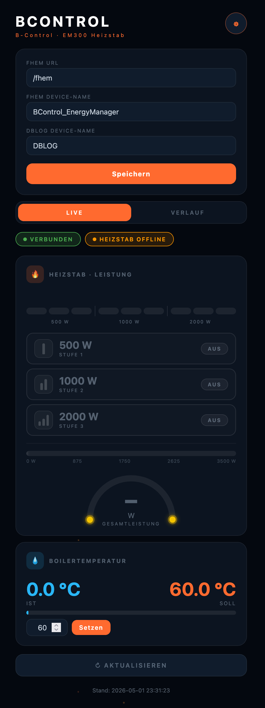
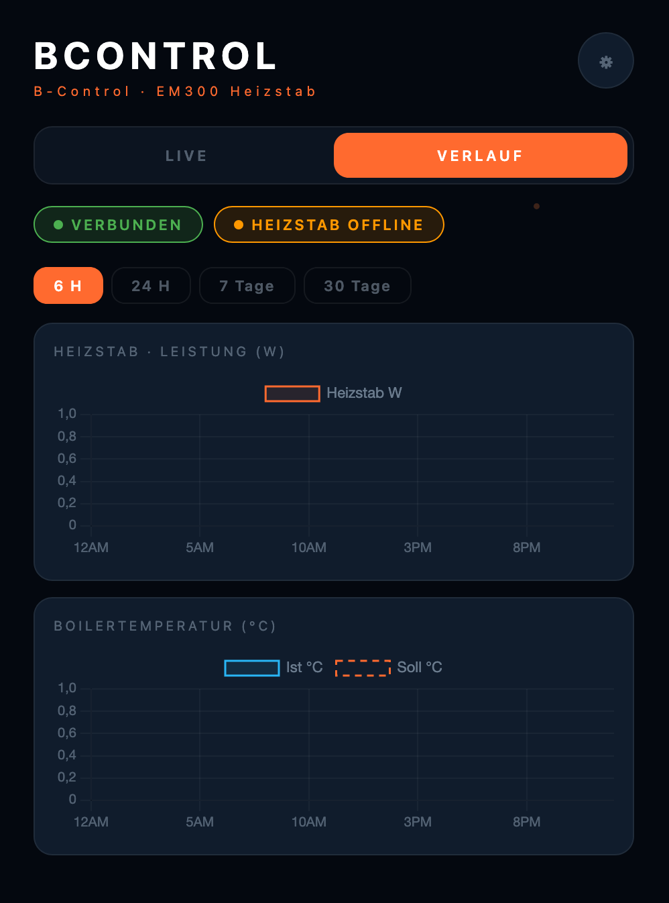

# 73_BControl.pm

FHEM-Modul für den **B-Control EM300 Energiemanager / Heizstab** – holt Sensordaten direkt über die lokale HTTP-API des Geräts, ohne Cloud-Account oder externen Proxy.

> Getestet mit: **B-Control EM300** mit angeschlossenem 3-stufigen Heizstab (500 W / 1000 W / 2000 W)
> Entwickelt als Ersatz für das bisherige Setup: `HTTPMOD` + `DOIF` + `AT` aus `bcontrol.cfg`

**Alle bisherigen Reading-Namen bleiben erhalten** – DbLog-Definitionen, SVG-Plots und Notify-Regeln funktionieren ohne Änderungen weiter.

---

## Inhalt

- [Funktionsweise](#funktionsweise)
- [Voraussetzungen](#voraussetzungen)
- [Installation](#installation)
- [Einrichtung](#einrichtung)
- [Attribute](#attribute)
- [Set-Befehle](#set-befehle)
- [Get-Befehle](#get-befehle)
- [Internals](#internals)
- [Readings](#readings)
- [Beispiel-Konfiguration](#beispiel-konfiguration)
- [Webapp](#webapp)
- [Hintergrund: API-Flow](#hintergrund-api-flow)
- [Migration von HTTPMOD](#migration-von-httpmod)

---

## Funktionsweise

Das Modul verbindet sich direkt mit der **lokalen HTTP-API** des B-Control EM300 im Heimnetz. Kein Cloud-Account, kein externer Proxy.

Der Ablauf:

```
POST /start.php (Cookie-Login) → GET /mum-webservice/unieq.php (Sensordaten) → Readings schreiben
```

Die Authentifizierung erfolgt über ein **Cookie-Session**-Verfahren: Das Modul meldet sich per POST an `/start.php` an, erhält einen Session-Cookie und sendet diesen bei allen weiteren Anfragen mit. Bei `"authentication":false` in der Antwort oder bei Verbindungsproblemen wird automatisch neu angemeldet.

---

## Voraussetzungen

- FHEM ab Version 6.x
- Perl-Module (alle Standard, meist vorhanden):
  - `JSON` (sonst: `apt install libjson-perl`)
  - `URI::Escape` (sonst: `apt install liburi-perl`)
- `HttpUtils` (FHEM-intern, immer vorhanden)
- B-Control EM300 im lokalen Netzwerk (HTTP Port 80)
- Passwort des Geräts (Standard-Passwort leer oder gerätespezifisch)

---

## Installation

1. `73_BControl.pm` in das FHEM-Modulverzeichnis kopieren:

```bash
cp 73_BControl.pm /opt/fhem/FHEM/
```

2. FHEM neu starten oder das Modul laden:

```
reload 73_BControl
```

3. *(Optional)* Webapp installieren:

```bash
cp -r www/bcontrol /opt/fhem/www/
```

---

## Einrichtung

### 1. Device anlegen

```
define BControl_EnergyManager BControl 192.168.178.115
```

### 2. Passwort setzen

Das Passwort wird **verschlüsselt** im internen FHEM-Schlüsselspeicher abgelegt und erscheint **nicht** in der `fhem.cfg`.

```
# Mit Passwort:
set BControl_EnergyManager password deinPasswort

# Ohne Passwort (B-Control WebGUI: "Anmeldung ohne Kennwort"):
set BControl_EnergyManager nopassword
```

### 3. Intervall konfigurieren

```
attr BControl_EnergyManager interval 60
```

---

## Attribute

| Attribut | Standard | Beschreibung |
|---|---|---|
| `interval` | `60` | Abfrage-Intervall in Sekunden |
| `port` | `80` | HTTP-Port des Geräts |
| `disable` | `0` | `1` = alle Abfragen deaktivieren |
| `disabledForIntervals` | – | Abfragen in Zeitbereichen deaktivieren, z.B. `23:00-06:00` |
| `event-on-change-reading` | – | Nur bei Wertänderung Events erzeugen |

---

## Set-Befehle

| Befehl | Beschreibung |
|---|---|
| `set <name> password <Passwort>` | Passwort verschlüsselt speichern und Login starten |
| `set <name> nopassword` | Login ohne Passwort konfigurieren |
| `set <name> update` | Sofortigen Datenabruf anstoßen |
| `set <name> relogin` | Session zurücksetzen und neu anmelden |
| `set <name> Boilertemperatur_soll <°C>` | Soll-Temperatur des Boilers setzen (0–99 °C) |

---

## Get-Befehle

| Befehl | Beschreibung |
|---|---|
| `get <name> update` | Sofortiger Datenabruf |
| `get <name> raw` | Rohe JSON-Antwort des Geräts ins FHEM-Log schreiben (Debug) |

---

## Internals

| Internal | Beschreibung |
|---|---|
| `API_LAST_MSG` | Letzter HTTP-Status-Code (200 = OK) |
| `API_LAST_RES` | Unix-Timestamp des letzten erfolgreichen Abrufs |
| `NEXT` | Zeitpunkt des nächsten geplanten Abrufs |
| `SERIAL` | Seriennummer des Geräts (falls im Login zurückgegeben) |
| `APP_VERSION` | Firmware-Version des Geräts |
| `SOURCE` | API-Endpunkt |
| `VERSION` | Modulversion |

---

## Readings

### Heizstab (Backward-kompatibel, exakt wie bisheriger HTTPMOD-Setup)

| Reading | Einheit | Beschreibung |
|---|---|---|
| `Heizstab_500W` | on/off | Status Heizstufe 500 W |
| `Heizstab_1000W` | on/off | Status Heizstufe 1000 W |
| `Heizstab_2000W` | on/off | Status Heizstufe 2000 W |
| `Heizstab_Total_Watt` | W | Gesamtleistung Heizstab |
| `Boilertemperatur_ist` | °C | Aktuelle Boilertemperatur |
| `Boilertemperatur_soll` | °C | Solltemperatur Boiler |
| `state` | – | State-String (identisch zu bisherigem stateFormat) |

### Gerätestatus

| Reading | Beschreibung |
|---|---|
| `deviceState` | Status des Geräts: `online` / `offline` / `error` |
| `lastUpdate` | Zeitstempel des letzten erfolgreichen Abrufs |

### Energiemessung EM300 (optional, falls vom Gerät geliefert)

| Reading | Einheit | Beschreibung |
|---|---|---|
| `Power_L1` / `Power_L2` / `Power_L3` | W | Wirkleistung je Phase |
| `Power_total` | W | Wirkleistung gesamt |
| `Voltage_L1` / `Voltage_L2` / `Voltage_L3` | V | Spannung je Phase |
| `Current_L1` / `Current_L2` / `Current_L3` | A | Strom je Phase |
| `Frequency` | Hz | Netzfrequenz |
| `PowerFactor` | – | Leistungsfaktor |
| `total_energy_*` | kWh | Wirkenergie (aus Wh umgerechnet) |

---

## Beispiel-Konfiguration

```perl
# Device anlegen
define BControl_EnergyManager BControl 192.168.178.123

# Passwort einmalig setzen – erscheint NICHT in fhem.cfg:
# set BControl_EnergyManager password deinPasswort

attr BControl_EnergyManager alias B-Control EnergyManager Heizstab
attr BControl_EnergyManager interval 60

attr BControl_EnergyManager event-on-change-reading Heizstab_Total_Watt,Boilertemperatur_ist,Boilertemperatur_soll
attr BControl_EnergyManager DbLogExclude .*
attr BControl_EnergyManager DbLogInclude Heizstab_Total_Watt,Boilertemperatur_ist,Boilertemperatur_soll
```

---

## Webapp

Unter `www/bcontrol/index.html` liegt eine vollständige Single-File-Webapp mit:

- **Heizstab-Stufen**: Drei farbige Kacheln (500 W / 1000 W / 2000 W) zeigen aktive Stufen
- **Gesamtleistung**: Große Watt-Anzeige mit automatischer W/kW-Umschaltung
- **Boilertemperatur**: Ist/Soll-Anzeige mit Balken und direktem Eingabefeld zum Setzen der Solltemperatur
- **Energiemessung**: Phasenweise Leistungs- und Spannungsanzeige (falls vom Gerät geliefert)
- **Verlaufs-Charts** (Tab): Heizstab-Leistung und Boilertemperatur (Ist/Soll) aus DbLog

### Webapp installieren

```bash
cp -r www/bcontrol /opt/fhem/www/
```

Aufruf im Browser:

```
http://<fhem-ip>:8083/fhem/www/bcontrol/
```

Beim ersten Aufruf über das Einstellungs-Icon (⚙) konfigurieren:
- **FHEM URL**: z.B. `/fhem` (selber Host) oder `http://192.168.178.x:8083/fhem`
- **FHEM Device-Name**: `BControl_EnergyManager` (oder eigener Name)
- **DbLog Device-Name**: `DBLOG`

### Screenshots

| Live-Ansicht | Verlauf |
|:---:|:---:|
|  |  |

---

## Hintergrund: API-Flow

```
POST http://{ip}/start.php
  Body: password={pw}
  → Set-Cookie: PHPSESSID=…
  → JSON: { "authentication": true, "serial": "…", "app_version": "…" }

GET http://{ip}/mum-webservice/unieq.php?method=GET&identifier=remaked&context=sensor
  Header: Cookie: PHPSESSID=…
  → JSON (flache Schlüssel):
    {
      "authentication": true,
      "meters_01_state": "online",
      "meters_01_switches_01_state": "on",
      "meters_01_switches_02_state": "off",
      "meters_01_switches_03_state": "off",
      "meters_01_registers_01_value": "1500",
      "meters_01_temperatur_boiler": "54.2",
      "meters_01_user_temperatur_nominal": "60",
      ...
    }

POST http://{ip}/mum-webservice/unieq.php?method=SET&identifier=remaked&context=sensor
  Header: Cookie: PHPSESSID=…
  Body:   {"meters_01_user_temperatur_nominal": "65"}
  → Solltemperatur setzen
```

Bei `"authentication": false` in der Antwort → automatischer Re-Login.

---

## Migration von HTTPMOD

Das neue Modul ersetzt folgende Definitionen aus `bcontrol.cfg` vollständig:

| Alt | Neu |
|---|---|
| `HTTPMOD BControl_EnergyManager_Heizstab` | `BControl BControl_EnergyManager` |
| `HTTPMOD BControl_EnergyManager_Heizstab_Status` | integriert (Reading `deviceState`) |
| `DOIF BControl_EnergyManager_Heizstab_Korrektur_wenn_offline_DOIF` | integriert (automatische Re-Auth + Fehlerbehandlung) |
| `AT BControl_EnergyManager_Heizstab_Updater_AT` | integriert (InternalTimer via `interval`-Attribut) |

Die Reading-Namen `Heizstab_500W`, `Heizstab_1000W`, `Heizstab_2000W`, `Heizstab_Total_Watt`, `Boilertemperatur_ist`, `Boilertemperatur_soll` bleiben **identisch** – keine Anpassung an DbLog, SVG-Plots oder Notify nötig.

---

## Lizenz

GPL v2

## Autor

Markus Eckert · [github.com/eckonator](https://github.com/eckonator)

---

## Verwandte Module

- [73_Plenticore.pm](../FHEM-Plenticore/README.md) – FHEM-Modul für den Kostal Plenticore Wechselrichter
- [bcontrol-em300-hacs](https://github.com/ITTV-Tools/bcontrol-em300-hacs) – Home Assistant Integration (Basis der API-Analyse)
